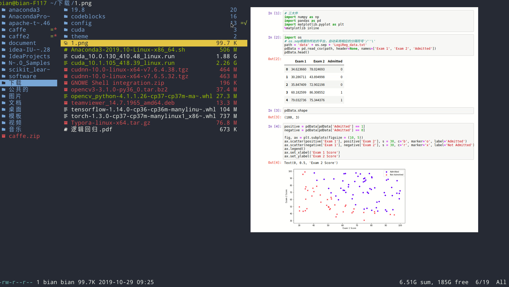
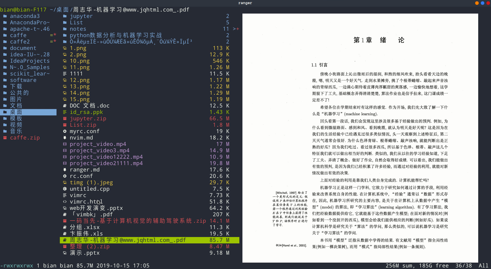
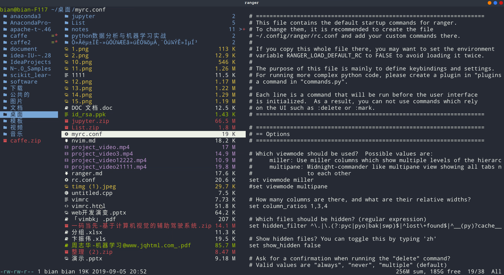

 

 

 

# Summary

| 快捷键   | 作用                             | 映射          |
| :------- | :------------------------------- | :------------ |
| `o`      | 排序                             | -=nN          |
| `/`      | 查找文件名                       | -=nN          |
| `f`      | 查找文件名(只显示含文件名得文件) |               |
| `<C-f>`  | fzf                              |               |
| `yp`     | 复制当前文件路径                 |               |
| `yn`     | 复制文件名                       |               |
| `y.`     | 去掉文件后缀的文件名             |               |
| `V`      | 创建文件                         |               |
| `M`      | 创建文件夹                       |               |
| `cw`     | 重命名文件（多文件时nvim编辑）   |               |
| `V`      | 选中所有文件                     |               |
| `space`  | 选中当前文件                     |               |
| `yy`     | 复制                             |               |
| `pp`     | 粘贴                             |               |
| `po`     | 覆盖                             |               |
| `dd`     | 剪切                             |               |
| `dD`     | 删除                             |               |
| `dU`     | 显示文件目录下大小               |               |
| `w`      | 任务管理器                       |               |
| `W`      |                                  | display_log   |
| `q或w`   | 退出任务管理器                   |               |
| `C`      | 压缩                             |               |
| `X`      | 解压                             |               |
| `cp`     | md文件转为pdf                    |               |
| `ytb`    | 下载youtube视频                  |               |
| `ygt`    | 下载B站视频                      |               |
| `R`      | 刷新cwd                          | reload_cwd    |
| `<c-r>`  | 刷新窗口                         | redraw_window |
| `~`      | 缩略图                           |               |

# Basic

| 快捷键       | 作用               | 映射                   |
| ------------ | ------------------ | ---------------------- |
| `~`          | 缩略图             | set viewmode!          |
| `i`          | 全窗口显示文件内容 | display_file           |
| `w`          | 任务管理器         |                        |
| `W`          | 窗口信息           | display_log            |
| `S`          |                    | shell $SHELL           |
| `!`          |                    | console shell%space    |
| `@`          |                    | console -p6 shell  %%s |
| `s`          |                    | console shell%space    |
| `cd`         |                    | console cd%space       |
| `<UP>`       |                    | pager_move  down=1     |
| `<DOWN>`     |                    |                        |
| `<LEFT>`     |                    |                        |
| `<RIGHT>`    |                    |                        |
| `<HOME>`     |                    |                        |
| `<END>`      |                    |                        |
| `<PAGEDOWN>` | 下一页             |                        |
| `<PAGEUP>`   | 上一页             |                        |
| `<INSERT>`   | nvim创建文件       | console nvim%space     |
| `<DELETE>`   | 删除文件           | console delete         |
| `J`          | 向下移动半屏       | 等价<C-d>              |
| `K`          | 向上移动半屏       | 等价<C-u>              |

# Change the line mode
| 快捷键   | 作用             | 映射 |
| :------- | :--------------- | :--- |
| `Mf`     | 显示文件名       |      |
| `Mi`     | 显示文件图标     |      |
| `Mm`     | 显示文件日期     |      |
| `Mp`     | 显示文件权限     |      |
| `Ms`     | 显示文件大小时间 |      |
| `Mt`     | 标准模式         |      |

# Tagging / Marking
| 快捷键   | 作用             | Cool                            |
| :------- | :--------------- | :------------------------------ |
| `t`      | 标记             | tag_toggle                      |
| `ut`     | 取消标记         | tag_remove                      |
| `"<any>` | 标记任意符号     | tag_toggle tag=%any             |
| `space`  | 选中文件         | mark_files toggle=True          |
| `v`      | 全选             | mark_files all=True toggle=True |
| `uv`     | 取消全选         | mark_files all=True val=False   |
| `V`      | 进入选择模式     | toggle_visual_mode              |
| `uV`     | 进去选择取消模式 | toggle_visual_mode reverse=True |

# F1-F10 Function key
| 快捷键   | 作用               | Cool                |
| :------- | :----------------- | :------------------ |
| `<F1>`   | 帮助               | help                |
| `<F3>`   | 全窗口显示文件内容 | display_file        |
| `<F4>`   | 编辑               | edit                |
| `<F5>`   | 复制               | copy                |
| `<F6>`   | 剪切               | cut                 |
| `<F7>`   | 创建文件夹         | console mkdir%space |
| `<F8>`   | 删除               | console delete      |
| `<F10>`  | 退出               | exit                |

# Jumping around
| 快捷键   | 作用         | Cool           |
| :------- | :----------- | :------------- |
| `{`      | 返回上一步   | history_go -1  |
| `}`      | 撤销上一步   | history_go 1   |
| `]`      | 父目录下一个 | move_parent 1  |
| `[`      | 父目录上一个 | move_parent -1 |

# Custom Jumping around
| 快捷键 | 作用 | Cool                  |
| :----- | :--- | :-------------------- |
| `g/`   |      | cd /                  |
| `gh`   |      | cd ~                  |
| `gs`   |      | cd ~/software         |
| `gd`   |      | cd ~/document         |
| `gi`   |      | cd ~/document/github  |
| `gD`   |      | cd ~/桌面             |
| `gS`   |      | cd ~/文档             |
| `gI`   |      | cd ~/图片             |
| `gA`   |      | cd ~/下载             |
| `gV`   |      | cd ~/视频             |
| `gC`   |      | cd ~/.config          |
| `gN`   |      | cd ~/.config/nvim     |
| `gP`   |      | cd ~/.config/nvim/tmp |
| `gR`   |      | cd ~/.config/ranger   |

# External Programs
| 快捷键   | 作用             | Cool                                                         |
| :------- | :--------------- | :----------------------------------------------------------- |
| `E`      |                  | edit                                                         |
| `du`     | 显示目录文件大小 | shell -p du --max-depth=1 -h --apparent-size                 |
| `dU`     |                  | shell -p du --max-depth=1 -h --apparent- size &#124; sort -rh |
| `yp`     | 复制当前路径     | shell -f echo -n %d/%f &#124; xsel -i; xsel -o &#124; xsel -i -b |
| `yd`     |                  | shell -f echo -n %d       &#124; xsel -i; xsel -o &#124; xsel -i -b |
| `yn`     | 复制文件名       | shell -f echo -n %f        &#124; xsel -i; xsel -o &#124; xsel -i -b |

# Filesystem Operations
| 快捷键   | 作用 | 映射                                                         |
| :------- | :--- | :----------------------------------------------------------- |
| `=`      |      | chmod                                                        |
| `cw`     |      | console rename%space                                         |
| `a`      |      | rename_append                                                |
| `A`      |      | eval fm.open_console('rename ' + fm.thisfile.relative_path.replace("%", "%%")) |
| `I`      |      | eval fm.open_console('rename ' + fm.thisfile.relative_path.replace("%", "%%"), position=7) |
| `pp`     |      | paste                                                        |
| `po`     |      | paste overwrite=True                                         |
| `pP`     |      | paste append=True                                            |
| `pO`     |      | paste overwrite=True append=True                             |
| `pl`     |      | paste_symlink relative=False                                 |
| `pL`     |      | paste_symlink relative=True                                  |
| `phl`    |      | paste_hardlink                                               |
| `pht`    |      | paste_hardlinked_subtree                                     |
| `dD`     |      | console delete                                               |
| `dd`     |      | cut                                                          |
| `ud`     |      | uncut                                                        |
| `da`     |      | cut mode=add                                                 |
| `dr`     |      | cut mode=remove                                              |
| `dt`     |      | cut mode=toggle                                              |
| `yy`     |      | copy                                                         |
| `uy`     |      | uncut                                                        |
| `ya`     |      | copy mode=add                                                |
| `yr`     |      | copy mode=remove                                             |
| `yt`     |      | copy mode=toggle                                             |

# Temporary workarounds
| 快捷键   | 作用 | 映射                                               |
| :------- | :--- | :------------------------------------------------- |
| `dgg`    |      | eval fm.cut(dirarg=dict(to=0), narg=quantifier)    |
| `dG`     |      | eval fm.cut(dirarg=dict(to=-1), narg=quantifier)   |
| `dj`     |      | eval fm.cut(dirarg=dict(down=1), narg=quantifier)  |
| `dk`     |      | eval fm.cut(dirarg=dict(up=1), narg=quantifier)    |
| `ygg`    |      | eval fm.copy(dirarg=dict(to=0), narg=quantifier)   |
| `yG`     |      | eval fm.copy(dirarg=dict(to=-1), narg=quantifier)  |
| `yj`     |      | eval fm.copy(dirarg=dict(down=1), narg=quantifier) |
| `yk`     |      | eval fm.copy(dirarg=dict(up=1), narg=quantifier)   |

# Searching
| 快捷键   | 作用 | 映射                       |
| :------- | :--- | :------------------------- |
| `/`      |      | console search%space       |
| `n`      |      | search_next                |
| `N`      |      | search_next forward=False  |
| `ct`     |      | search_next order=tag      |
| `cs`     |      | search_next order=size     |
| `ci`     |      | search_next order=mimetype |
| `cc`     |      | search_next order=ctime    |
| `cm`     |      | search_next order=mtime    |
| `ca`     |      | search_next order=atime    |

# Tabs
| 快捷键      | 作用 | 映射        |
| :---------- | :--- | :---------- |
| `<C-n>`     |      | tab_new ~   |
| `<C-w>`     |      | tab_close   |
| `<TAB>`     |      | tab_move 1  |
| `<S-TAB>`   |      | tab_move -1 |
| `<A-Right>` |      | tab_move 1  |
| `<A-Left>`  |      | tab_move -1 |
| `gt`        |      | tab_move 1  |
| `gT`        |      | tab_move -1 |
| `gn`        |      | tab_new ~   |
| `gc`        |      | tab_close   |
| `uq`        |      | tab_restore |
| `<a-1>`     |      | tab_open 1  |
| `<a-2>`     |      | tab_open 2  |
| `<a-3>`     |      | tab_open 3  |
| `<a-4>`     |      | tab_open 4  |
| `<a-5>`     |      | tab_open 5  |
| `<a-6>`     |      | tab_open 6  |
| `<a-7>`     |      | tab_open 7  |
| `<a-8>`     |      | tab_open 8  |
| `<a-9>`     |      | tab_open 9  |

# Sorting
| 快捷键   | 作用 | 映射                                             |
| :------- | :--- | :----------------------------------------------- |
| `or`     |      | set sort_reverse!                                |
| `oz`     |      | set sort=random                                  |
| `os`     |      | chain set sort=size;      set sort_reverse=False |
| `ob`     |      | chain set sort=basename;  set sort_reverse=False |
| `on`     |      | chain set sort=natural;   set sort_reverse=False |
| `om`     |      | chain set sort=mtime;     set sort_reverse=False |
| `oc`     |      | chain set sort=ctime;     set sort_reverse=False |
| `oa`     |      | chain set sort=atime;     set sort_reverse=False |
| `ot`     |      | chain set sort=type;      set sort_reverse=False |
| `oe`     |      | chain set sort=extension; set sort_reverse=False |
|          |      |                                                  |
| `oS`     |      | chain set sort=size;      set sort_reverse=True  |
| `oB`     |      | chain set sort=basename;  set sort_reverse=True  |
| `oN`     |      | chain set sort=natural;   set sort_reverse=True  |
| `oM`     |      | chain set sort=mtime;     set sort_reverse=True  |
| `oC`     |      | chain set sort=ctime;     set sort_reverse=True  |
| `oA`     |      | chain set sort=atime;     set sort_reverse=True  |
| `oT`     |      | chain set sort=type;      set sort_reverse=True  |
| `oE`     |      | chain set sort=extension; set sort_reverse=True  |
|          |      |                                                  |
| `dc`     |      | get_cumulative_size                              |

# Settings
| 快捷键   | 作用 | 映射                            |
| :------- | :--- | :------------------------------ |
| `zc`     |      | set collapse_preview!           |
| `zd`     |      | set sort_directories_first!     |
| `zh`     |      | set show_hidden!                |
| `<C-h>`  |      | set show_hidden!                |
| `zI`     |      | set flushinput!                 |
| `zi`     |      | set preview_images!             |
| `zm`     |      | set mouse_enabled!              |
| `zp`     |      | set preview_files!              |
| `zP`     |      | set preview_directories!        |
| `zs`     |      | set sort_case_insensitive!      |
| `zu`     |      | set autoupdate_cumulative_size! |
| `zv`     |      | set use_preview_script!         |
| `zf`     |      | console filter%space            |

# Bookmarks
| 快捷键        | 作用 | 映射                         |
| :------------ | :--- | :--------------------------- |
| ``<any>`      |      | enter_bookmark %any          |
| `map '<any>`  |      | enter_bookmark %any          |
| `map m<any>`  |      | set_bookmark %any            |
| `map um<any>` |      | unset_bookmark %any          |
|               |      |                              |
| `m<bg>`       |      | draw_bookmarks               |
| `m<bg>`       |      | um<bg> `<bg> '<bg>           |
|               |      |                              |
| `<tab>`       |      | eval fm.ui.console.tab()     |
| `<s-tab>`     |      | eval fm.ui.console.tab(-1)   |
| `<ESC>`       |      | eval fm.ui.console.close()   |
| `<CR>`        |      | eval fm.ui.console.execute() |
| `<C-l>`       |      | redraw_window                |
|               |      |                              |
| `<ESC>`       |      | <C-c>                        |
| `<CR>`        |      | <C-j>                        |

# Move around
| 快捷键      | 作用 | 映射                                             |
| :---------- | :--- | :----------------------------------------------- |
| `<up>`      |      | eval fm.ui.console.history_move(-1)              |
| `<down>`    |      | eval fm.ui.console.history_move(1)               |
| `<left>`    |      | eval fm.ui.console.move(left=1)                  |
| `<right>`   |      | eval fm.ui.console.move(right=1)                 |
| `<home>`    |      | eval fm.ui.console.move(right=0, absolute=True)  |
| `<end>`     |      | eval fm.ui.console.move(right=-1, absolute=True) |
| `<a-left>`  |      | eval fm.ui.console.move_word(left=1)             |
| `<a-right>` |      | eval fm.ui.console.move_word(right=1)            |

# Line Editing
| 快捷键        | 作用 | 映射                                           |
| :------------ | :--- | :--------------------------------------------- |
| `<backspace>` |      | eval fm.ui.console.delete(-1)                  |
| `<delete>`    |      | eval fm.ui.console.delete(0)                   |
| `<C-w>`       |      | eval fm.ui.console.delete_word()               |
| `<A-d>`       |      | eval fm.ui.console.delete_word(backward=False) |
| `<C-k>`       |      | eval fm.ui.console.delete_rest(1)              |
| `<C-u>`       |      | eval fm.ui.console.delete_rest(-1)             |
| `<C-y>`       |      | eval fm.ui.console.paste()                     |

#### ===================== Taskview Keybindings =====================

# Movement
| 快捷键       | 作用 | 映射                               |
| :----------- | :--- | :--------------------------------- |
| `<up>`       |      | taskview_move up=1                 |
| `<down>`     |      | taskview_move down=1               |
| `<home>`     |      | taskview_move to=0                 |
| `<end>`      |      | taskview_move to=-1                |
| `<pagedown>` |      | taskview_move down=1.0  pages=True |
| `<pageup>`   |      | taskview_move up=1.0    pages=True |
| `<C-d>`      |      | taskview_move down=0.5  pages=True |
| `<C-u>`      |      | taskview_move up=0.5    pages=True |
|              |      |                                    |
| `<UP>`       |      | k  <C-p>                           |
| `<DOWN>`     |      | j  <C-n> <CR>                      |
| `<HOME>`     |      | g                                  |
| `<END>`      |      | G                                  |
| `<C-u>`      |      | u                                  |
| `<PAGEDOWN>` |      | n  f  <C-E>  <Space>               |
| `<PAGEUP>`   |      | p  b  <C-B>                        |

# Changing priority and deleting tasks
| 快捷键       | 作用 | 映射                                 |
| :----------- | :--- | :----------------------------------- |
| `J`          |      | eval -q fm.ui.taskview.task_move(-1) |
| `K`          |      | eval -q fm.ui.taskview.task_move(0)  |
| `dd`         |      | eval -q fm.ui.taskview.task_remove() |
| `<pagedown>` |      | eval -q fm.ui.taskview.task_move(-1) |
| `<pageup>`   |      | eval -q fm.ui.taskview.task_move(0)  |
| `<delete>`   |      | eval -q fm.ui.taskview.task_remove() |

# Basic
| 快捷键   | 作用 | 映射           |
| :------- | :--- | :------------- |
| `<C-l>`  |      | redraw_window  |
| `<ESC>`  |      | taskview_close |
| `<ESC>`  |      | q Q w <C-c>    |
